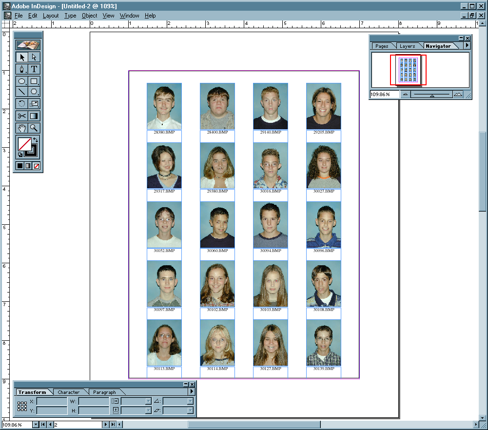

# EZIMAGE - Photographic Image Compositing and Conversion Utility

Welcome to EZIMAGE, a cutting-edge photographic image compositing and conversion utility developed by Redmer Software Company. This tool is designed to simplify and enhance your image processing tasks with a user-friendly interface and powerful features.

## Table of Contents

- [Features](#features)
- [Installation](#installation)
- [Usage](#usage)
- [Contributing](#contributing)
- [License](#license)
- [Contact](#contact)

## Features

- **Image Compositing**: Seamlessly combine multiple images into a single composite.
- **Format Conversion**: Convert images between various formats including JPEG, PNG, BMP, and more.
- **Batch Processing**: Process multiple images at once to save time and effort.
- **Filters and Effects**: Apply a wide range of filters and effects to enhance your images.
- **User-Friendly Interface**: Intuitive and easy-to-use interface for both beginners and professionals.
- **High Performance**: Optimized for fast processing and minimal resource usage.

## Screens

## Installation

To install EZIMAGE, follow these steps:

1. Download the latest version of EZIMAGE from the [releases page](https://github.com/your-repo/museum-redmer-software-ezimage/releases).
2. Extract the downloaded archive to your desired location.
3. Run the `EZIMAGE.exe` file to start the application.

## Usage

### Compositing Images

1. Open EZIMAGE.
2. Click on the "Composite" tab.
3. Add the images you want to composite.
4. Arrange the images as desired.
5. Click "Create Composite" to generate the final image.

### Converting Image Formats

1. Open EZIMAGE.
2. Click on the "Convert" tab.
3. Add the images you want to convert.
4. Select the desired output format.
5. Click "Convert" to start the conversion process.

### Applying Filters and Effects

1. Open EZIMAGE.
2. Click on the "Edit" tab.
3. Add the image you want to edit.
4. Choose the filter or effect you want to apply.
5. Click "Apply" to see the changes.

## Contributing

We welcome contributions from the community! If you would like to contribute to EZIMAGE, please follow these steps:

1. Fork the repository.
2. Create a new branch for your feature or bugfix.
3. Make your changes and commit them with clear and concise messages.
4. Push your changes to your fork.
5. Submit a pull request to the main repository.

Please ensure that your code adheres to our coding standards and includes appropriate tests.

#
## Contact

### Follow

### Sponsor

### Web

## License
This project is licensed under the MIT License. See the [LICENSE](LICENSE) file for more details.
